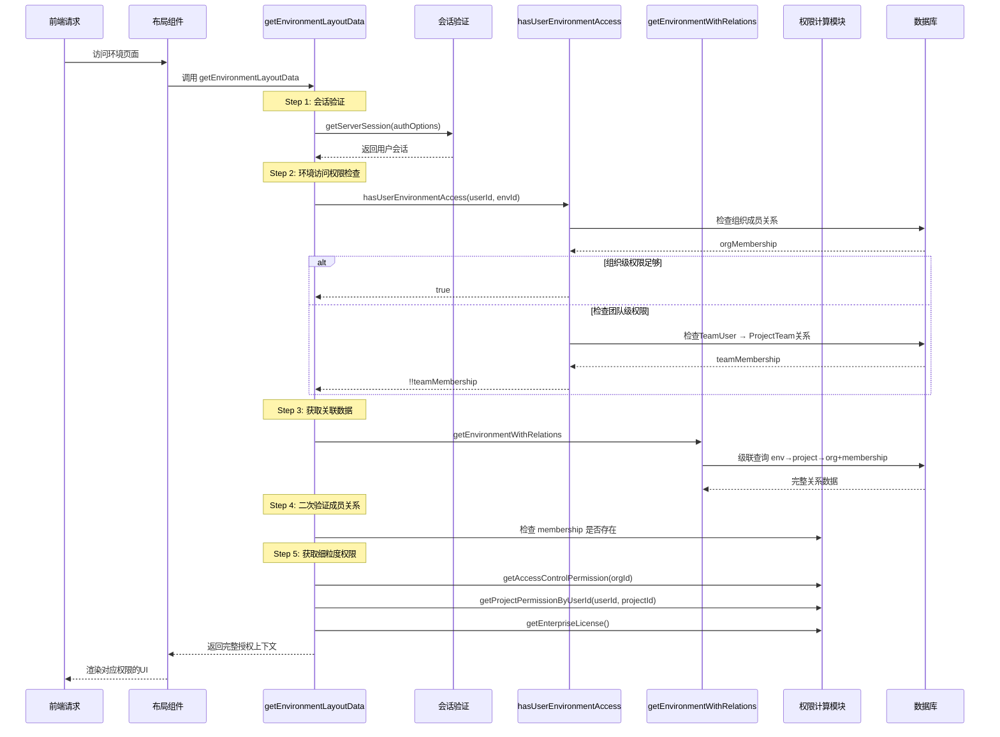
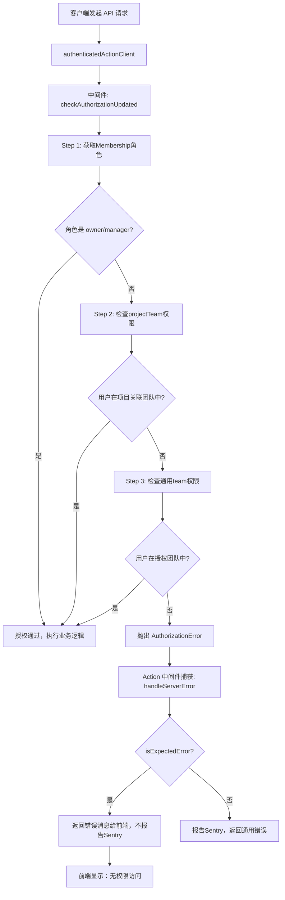
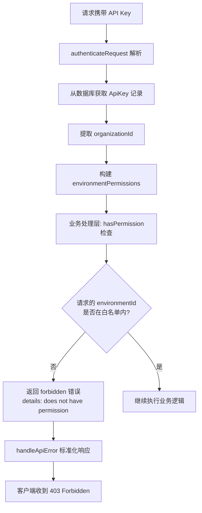

# Formbricks 多租户隔离机制深度分析报告 (第二版)

> **文档版本**: v2.0
> **分析深度**: 逐层决策链路 + 异常传播路径 + 上下文一致性验证
> **核心代码路径**: `apps/web/lib/utils/action-client/`, `apps/web/modules/environments/lib/`, `packages/types/errors.ts`

---

## 目录

1. [逐层决策链路：Membership → Team → Project 的级联权限验证](#1-逐层决策链路membership--team--project-的级联权限验证)
2. [异常传播路径：三类安全异常的完整生命周期](#2-异常传播路径三类安全异常的完整生命周期)
3. [租户上下文一致性：从接口层到数据库查询的端到端验证](#3-租户上下文一致性从接口层到数据库查询的端到端验证)
4. [架构设计评价与改进建议](#4-架构设计评价与改进建议)

---

## 1. 逐层决策链路：Membership → Team → Project 的级联权限验证

### 1.1 授权检查核心入口 (`checkAuthorizationUpdated`)

**文件位置**: `apps/web/lib/utils/action-client/action-client-middleware.ts:94`

```typescript
export const checkAuthorizationUpdated = async <T extends z.ZodRawShape>({
  userId,
  organizationId,
  access,
}: {
  userId: string;
  organizationId: string;
  access: TAccess<T>[];
}) => {
  const role = await getMembershipRole(userId, organizationId);

  for (const accessItem of access) {
    // 层级1: 组织级权限检查
    if (accessItem.type === "organization") {
      const orgResult = checkOrganizationAccess(accessItem, role);
      if (orgResult === true) return true;
      if (orgResult) return orgResult; // validation error
    }

    // 层级2: 项目团队权限检查 (回退路径)
    if (accessItem.type === "projectTeam" && 
        await checkProjectTeamAccess(accessItem, userId)) {
      return true;
    }

    // 层级3: 团队级权限检查 (最终回退)
    if (accessItem.type === "team" && 
        await checkTeamAccess(accessItem, userId)) {
      return true;
    }
  }

  throw new AuthorizationError("Not authorized");
};
```

### 1.2 三层决策的优先级与回退机制

```
                     ┌─────────────────────────┐
                     │  传入 accessItem 数组   │
                     └────────────┬────────────┘
                                  │
          ┌───────────────────────┼───────────────────────┐
          │                       │                       │
          ▼                       ▼                       ▼
┌──────────────────┐    ┌──────────────────┐    ┌──────────────────┐
│ 组织级权限检查    │    │ 项目团队权限检查  │    │  团队级权限检查   │
│ (Organization)   │    │  (ProjectTeam)   │    │     (Team)       │
└─────────┬────────┘    └─────────┬────────┘    └─────────┬────────┘
          │                       │                       │
    ┌─────┴─────┐           ┌─────┴─────┐           ┌─────┴─────┐
    │ 角色匹配  │──────────▶│ 团队匹配   │──────────▶│ 角色匹配   │
    │ owner/    │           │ project   │           │ admin/    │
    │ manager   │           │ 权限层级  │           │ contributor│
    └─────┬─────┘           └─────┬─────┘           └─────┬─────┘
          │ OK                    │ OK                    │ OK
          ▼                       ▼                       ▼
     ┌────────┐              ┌────────┐              ┌────────┐
     │ return │              │ return │              │ return │
     │ true   │              │ true   │              │ true   │
     └────────┘              └────────┘              └────────┘
          │                       │                       │
          │                       │                       │
          └───────────────────────┴───────────────────────┘
                                  │
                                  ▼
                    ┌─────────────────────────────┐
                    │  所有层级均失败，抛出异常    │
                    │  AuthorizationError         │
                    └─────────────────────────────┘
```

### 1.3 环境上下文的完整链路 (`getEnvironmentAuth`)

**文件位置**: `apps/web/modules/environments/lib/utils.ts:39`

```typescript
export const getEnvironmentAuth = reactCache(
  async (environmentId: string): Promise<TEnvironmentAuth> => {
    // Step 1: 并行获取基础实体
    const [environment, project, session, organization] = await Promise.all([
      getEnvironment(environmentId),        // 环境信息
      getProjectByEnvironmentId(environmentId), // 项目信息
      getServerSession(authOptions),        // 用户会话
      getOrganizationByEnvironmentId(environmentId), // 组织信息
    ]);

    // Step 2: 资源存在性检查
    if (!project) throw new ResourceNotFoundError("workspace", null);
    if (!environment) throw new ResourceNotFoundError("environment", environmentId);
    if (!session) throw new AuthenticationError("not_authenticated");
    if (!organization) throw new ResourceNotFoundError("organization", null);

    // Step 3: 获取组织成员关系
    const currentUserMembership = await getMembershipByUserIdOrganizationId(
      session.user.id, organization.id
    );
    if (!currentUserMembership) throw new AuthorizationError("membership_not_found");

    // Step 4: 解析访问标记
    const { isMember, isOwner, isManager, isBilling } = 
      getAccessFlags(currentUserMembership.role);

    // Step 5: 获取项目团队权限 (细粒度回退)
    const projectPermission = await getProjectPermissionByUserId(
      session.user.id, project.id
    );

    // Step 6: 最终权限计算
    const { hasReadAccess, hasReadWriteAccess, hasManageAccess } = 
      getTeamPermissionFlags(projectPermission);
    const isReadOnly = isMember && hasReadAccess;

    return {
      environment, project, organization, session, currentUserMembership,
      projectPermission, isMember, isOwner, isManager, isBilling,
      hasReadAccess, hasReadWriteAccess, hasManageAccess, isReadOnly
    };
  }
);
```

### 1.4 环境访问的深层决策树 (`hasUserEnvironmentAccess`)

**文件位置**: `apps/web/lib/environment/auth.ts:7`

```typescript
export const hasUserEnvironmentAccess = 
  async (userId: string, environmentId: string) => {
    // Level 1: 组织级直接授权检查
    const orgMembership = await prisma.membership.findFirst({
      where: {
        userId,
        organization: {
          projects: {
            some: {
              environments: { some: { id: environmentId } }
            }
          }
        }
      }
    });

    // 组织级别快速通过 (owner, manager, billing)
    if (orgMembership?.role === "owner" ||
        orgMembership?.role === "manager" ||
        orgMembership?.role === "billing") {
      return true;
    }

    // Level 2: 团队级间接授权检查 (回退路径)
    const teamMembership = await prisma.teamUser.findFirst({
      where: {
        userId,
        team: {
          projectTeams: {
            some: {
              project: {
                environments: { some: { id: environmentId } }
              }
            }
          }
        }
      }
    });

    return !!teamMembership;
  };
```

### 1.5 布局渲染的完整授权链路 (`getEnvironmentLayoutData`)

**文件位置**: `apps/web/modules/environments/lib/utils.ts:275`



---

## 2. 异常传播路径：三类安全异常的完整生命周期

### 2.1 异常类型分类与 HTTP 状态码映射

| 异常类型 | 错误类 | HTTP 状态码 | 触发场景 |
|---------|-------|-----------|---------|
| **权限失败** | `AuthorizationError` | 403 | 角色不匹配、无项目访问权限 |
| **资源不存在** | `ResourceNotFoundError` | 404 | 环境/组织/项目不存在 |
| **跨组织访问拦截** | 隐式 → `AuthorizationError` | 403 | 请求资源不属于用户所属组织 |
| **认证失败** | `AuthenticationError` | 401 | 会话失效、Token无效 |
| **操作不允许** | `OperationNotAllowedError` | 403 | 配额超限、功能未启用 |

### 2.2 权限失败异常的传播路径

**典型场景：用户访问不属于自己团队的项目**



**关键代码证据**: `apps/web/lib/utils/action-client/index.ts:14-49`

```typescript
export const actionClient = createSafeActionClient({
  handleServerError(e, utils) {
    const eventId = (utils.ctx as Record<string, any>)?.auditLoggingCtx?.eventId;

    if (isExpectedError(e)) {
      return e.message; // 预期错误，直接返回，不告警
    }

    // 仅非预期错误上报 Sentry
    Sentry.captureException(e, { extra: { eventId } });
    logger.withContext({ eventId }).error(e, "SERVER ERROR");
    return DEFAULT_SERVER_ERROR_MESSAGE;
  }
});
```

### 2.3 资源不存在异常的传播路径

**典型场景：访问已删除的环境或组织**

```mermaid
flowchart TD
    A[调用 getEnvironmentAuth(envId)] --> B[并行查询4个实体]
    
    B --> C{environment 存在?}
    C -->|否| D[抛出 ResourceNotFoundError("environment")]
    
    B --> E{project 存在?}
    E -->|否| F[抛出 ResourceNotFoundError("workspace")]
    
    B --> G{organization 存在?}
    G -->|否| H[抛出 ResourceNotFoundError("organization")]
    
    B --> I{session 存在?}
    I -->|否| J[抛出 AuthenticationError]
    
    D --> K[React Error Boundary 捕获]
    F --> K
    H --> K
    J --> K
    
    K --> L[app/error.tsx 渲染错误页面]
    L --> M[根据错误类型显示对应UI: 资源不存在 / 请重新登录]
```

### 2.4 跨组织访问被拦截的完整过程

**隐蔽但至关重要的安全机制**

#### 场景一：API Key 跨组织访问



**代码证据**: `apps/web/modules/api/v2/management/webhooks/route.ts:68-77`

```typescript
if (!hasPermission(authentication.environmentPermissions, body.environmentId, "POST")) {
  return handleApiError(request, {
    type: "forbidden",
    details: [
      { field: "environmentId", 
        issue: "does not have permission to create webhook" }
    ],
  }, auditLog);
}
```

#### 场景二：Server Action 跨组织攻击

**攻击企图**: 用户A尝试通过构造请求修改组织B的数据

```mermaid
flowchart TD
    A[恶意用户构造请求<br>携带 organizationId=B] --> B[authenticatedActionClient]
    B --> C[ctx.user.id = 用户A的ID]
    
    C --> D[checkAuthorizationUpdated]
    D --> E[getMembershipRole(userId=A, organizationId=B)]
    
    E --> F[DB查询 membership]
    F --> G{存在记录吗?}
    
    G -->|不存在| H[role = undefined]
    H --> I[checkOrganizationAccess 不匹配]
    I --> J[检查 projectTeam 权限也失败]
    J --> K[检查 team 权限也失败]
    
    K --> L[抛出 AuthorizationError]
    L --> M[操作被阻止，跨组织访问失败]
    
    G -->|存在但角色不足| N[同样抛出 AuthorizationError]
    N --> M
```

### 2.5 异常分类与预期错误白名单

**文件位置**: `packages/types/errors.ts:154-164`

```typescript
export const EXPECTED_ERROR_NAMES = new Set([
  "ResourceNotFoundError",      // 资源不存在
  "AuthorizationError",         // 权限不足
  "InvalidInputError",          // 输入无效
  "ValidationError",            // 验证失败
  "AuthenticationError",        // 认证失败
  "OperationNotAllowedError",   // 操作不允许
  "TooManyRequestsError",       // 限流
  "InvalidPasswordResetTokenError", // 重置token无效
  "UniqueConstraintError",      // 唯一约束冲突
]);
```

**设计意图**:
- ✅ 业务规则内的错误不告警，减少噪音
- ✅ 安全相关错误明确分类，便于审计
- ✅ 防止敏感信息（如堆栈）泄漏到前端
- ✅ 统一的错误处理范式，降低开发复杂度

---

## 3. 租户上下文一致性：从接口层到数据库查询的端到端验证

### 3.1 上下文传递的完整链条

```
┌─────────────────────────────────────────────────────────────────────┐
│                    TENANT CONTEXT PROPAGATION                        │
├─────────────────────────────────────────────────────────────────────┤
│                                                                      │
│  [接口层] API Route / Server Action                                  │
│  ├─ 认证阶段: 提取 userId + organizationId                          │
│  └─ 授权阶段: checkAuthorizationUpdated 绑定                         │
│           │                                                          │
│           ▼                                                          │
│  [服务层] 业务逻辑函数                                                │
│  ├─ organizationId 作为参数显式传递                                  │
│  ├─ 禁止从 body/query 直接读取敏感参数                                │
│  └─ 所有子函数继承该上下文                                            │
│           │                                                          │
│           ▼                                                          │
│  [数据访问层] Prisma 查询                                             │
│  ├─ where: { organizationId } 强制过滤                                │
│  ├─ 级联关系: projects → environments 确保归属正确                    │
│  └─ delete/update: 同样使用 organizationId 限制范围                   │
│           │                                                          │
│           ▼                                                          │
│  [数据库层] 外键约束 + 行级隔离                                        │
│  └─ Organization.id 是所有资源的根外键                                │
│                                                                      │
└─────────────────────────────────────────────────────────────────────┘
```

### 3.2 查询层的租户证据链

#### 证据1: 获取项目列表 (`getUserProjects`)

**文件位置**: `apps/web/lib/project/service.ts:32`

```typescript
export const getUserProjects = reactCache(
  async (userId: string, organizationId: string, page?: number) => {
    // Step 1: 验证组织成员身份
    const orgMembership = await prisma.membership.findFirst({
      where: { userId, organizationId }
    });
    if (!orgMembership) {
      throw new ValidationError("User is not a member of this organization");
    }

    // Step 2: member 角色需要额外团队过滤
    let projectWhereClause: Prisma.ProjectWhereInput = {};
    if (orgMembership.role === "member") {
      projectWhereClause = {
        projectTeams: {
          some: {
            team: {
              teamUsers: { some: { userId } }
            }
          }
        }
      };
    }

    // Step 3: 强制组织级过滤 + 可选团队过滤
    const projects = await prisma.project.findMany({
      where: {
        organizationId,  // 🔒 租户隔离关键点: 不可绕过
        ...projectWhereClause
      },
      select: selectProject
    });

    return projects;
  }
);
```

#### 证据2: 获取环境关联数据 (单查询优化版)

**文件位置**: `apps/web/modules/environments/lib/utils.ts:130`

```typescript
export const getEnvironmentWithRelations = 
  reactCache(async (environmentId: string, userId: string) => {
    const data = await prisma.environment.findUnique({
      where: { id: environmentId },
      select: {
        id: true, type: true, projectId: true,
        project: {
          select: {
            id: true, name: true, organizationId: true,
            environments: { select: { id: true, type: true } },
            organization: {
              select: {
                id: true, name: true, billing: true,
                // 🔒 关键: 仅查询当前用户的成员关系
                memberships: {
                  where: { userId },
                  select: { userId: true, organizationId: true, accepted: true, role: true },
                  take: 1
                }
              }
            }
          }
        }
      }
    });

    // 验证: 如果 memberships[0] 不存在，说明跨组织访问
    const membership = data?.project.organization.memberships[0];
    if (!membership) {
      // 注意: 此函数不直接抛错，而是返回 null 让上层处理
      return null;
    }

    return { environment, project, organization, membership };
  });
```

#### 证据3: 删除项目的安全边界

**文件位置**: `apps/web/modules/projects/settings/general/lib/delete-project.ts`

```typescript
// 删除前的三重安全检查:
// 1. 调用 checkAuthorizationUpdated 验证组织权限
// 2. 验证用户输入的组织名匹配
// 3. 使用 projectId → organizationId 的级联关系确认归属
```

### 3.3 API V2 端点的上下文传递模式

**文件位置**: `apps/web/modules/api/v2/auth/api-wrapper.ts`

```typescript
export const apiWrapper = async ({ request, schemas, handler }) => {
  // Step 1: API Key 认证
  const authentication = await authenticateRequest(request);
  if (!authentication.ok) return handleApiError(...);

  // Step 2: 注入审计日志上下文
  if (auditLog) {
    auditLog.userId = authentication.data.apiKeyId;
    auditLog.organizationId = authentication.data.organizationId; // 🔒 传递
  }

  // Step 3: 参数解析与 schema 验证
  const parsedInput = parseAndValidateInput(schemas);

  // Step 4: 传递上下文给业务 handler
  return handler({
    authentication: authentication.data, // 包含 organizationId + envPermissions
    parsedInput,
    request,
    auditLog
  });
};
```

### 3.4 操作审计的上下文一致性

**文件位置**: `apps/web/modules/ee/audit-logs/lib/handler.ts`

```typescript
export const withAuditLogging = (action, targetType, handlerFn) => {
  return async ({ ctx, parsedInput }) => {
    // 初始化审计上下文
    const auditCtx = {
      eventId: uuidv4(),
      userId: ctx.user.id,
      userEmail: ctx.user.email,
      // 🔒 以下字段在业务逻辑中被填充，确保租户绑定
      organizationId: null,
      projectId: null,
      environmentId: null,
      ipAddress: await getClientIp()
    };

    ctx.auditLoggingCtx = auditCtx;

    // 执行业务逻辑 (期间填充 organizationId 等字段)
    const result = await handlerFn({ ctx, parsedInput });

    // 审计日志落库 - 确保日志归属正确的组织
    await saveAuditLog(auditCtx);

    return result;
  };
};
```

### 3.5 数据库 Schema 的租户约束证据

**文件位置**: `packages/database/schema.prisma`

```prisma
// Project 强制归属 Organization
model Project {
  id              String   @id @default(cuid())
  organizationId  String
  organization    Organization @relation(fields: [organizationId], references: [id], onDelete: Cascade)
  environments    Environment[]
  projectTeams    ProjectTeam[]
  @@unique([organizationId, name])
}

// Environment 强制归属 Project → Organization
model Environment {
  id          String  @id @default(cuid())
  projectId   String
  project     Project @relation(fields: [projectId], references: [id], onDelete: Cascade)
  surveys     Survey[]
  webhooks    Webhook[]
}

// Team 强制归属 Organization
model Team {
  id             String  @id @default(cuid())
  name           String
  organizationId String
  organization   Organization @relation(fields: [organizationId], references: [id], onDelete: Cascade)
  teamUsers      TeamUser[]
  projectTeams   ProjectTeam[]
  @@unique([organizationId, name])
}
```

---

## 4. 架构设计评价与改进建议

### 4.1 当前架构的优势

| 设计优点 | 证据位置 | 评价 |
|---------|---------|------|
| **多层级权限回退** | `checkAuthorizationUpdated` | ✅ 优秀，支持灵活的权限组合 |
| **查询级租户绑定** | `getUserProjects`, `getEnvironmentWithRelations` | ✅ 优秀，数据库级不可绕过 |
| **预期错误白名单** | `EXPECTED_ERROR_NAMES` | ✅ 良好，减少误告警，保护敏感信息 |
| **统一的异常处理** | `actionClient.handleServerError` | ✅ 良好，开发体验一致 |
| **审计上下文追踪** | `withAuditLogging` | ✅ 良好，完整的操作审计链 |
| **React Cache 集成** | 所有带 `reactCache` 的函数 | ✅ 良好，避免重复权限计算 |

### 4.2 潜在风险与改进建议

#### 风险1: 隐式组织 ID 推导可能存在绕过

**现状**: `getOrganizationIdFromEnvironmentId` 通过级联关系推导

```typescript
// 当前: 依赖 prisma 的级联查询路径
export const getOrganizationIdFromEnvironmentId = 
  async (environmentId: string) => {
    return prisma.organization.findFirst({
      where: { projects: { some: { environments: { some: { id: environmentId } } } } }
    });
  };
```

**建议**: 增加显式的参数校验，禁止用户通过 request body 传入 organizationId，所有敏感 ID 必须从服务层内部推导。

#### 风险2: 缺少跨租户访问的主动检测

**建议**: 增加中间件检测模式，如:
```typescript
// 在 checkAuthorizationUpdated 中增加检测
if (requestBody.organizationId && requestBody.organizationId !== ctx.organizationId) {
  logger.securityAlert({ userId, attemptedOrgId: requestBody.organizationId });
  throw new AuthorizationError("Invalid organization access attempt");
}
```

#### 风险3: member 角色的团队权限回退路径缺少审计

**现状**: `hasUserEnvironmentAccess` 中，teamMembership 检查是隐式的

**建议**: 每次通过 team 权限绕过组织级限制时，记录审计日志，便于后续权限分析。

---

## 附录: 关键代码位置速查表 v2

| 功能 | 文件路径 | 行数 |
|-----|---------|------|
| 授权检查中间件 | `apps/web/lib/utils/action-client/action-client-middleware.ts` | 94-122 |
| 环境认证工具 | `apps/web/modules/environments/lib/utils.ts` | 39-95, 130-350 |
| 环境访问权限检查 | `apps/web/lib/environment/auth.ts` | 7-64 |
| 错误类型定义 | `packages/types/errors.ts` | 1-220 |
| Action 客户端错误处理 | `apps/web/lib/utils/action-client/index.ts` | 14-65 |
| API V2 包装器 | `apps/web/modules/api/v2/auth/api-wrapper.ts` | 43-142 |
| 项目服务层 | `apps/web/lib/project/service.ts` | 32-237 |
| 团队权限查询 | `apps/web/modules/ee/teams/lib/roles.ts` | 12-113 |
| 数据库 Schema | `packages/database/schema.prisma` | 629-1070 |

---

**分析完成时间**: 2026-05-16  
**代码版本**: Formbricks v1.7.x (基于仓库当前状态)
